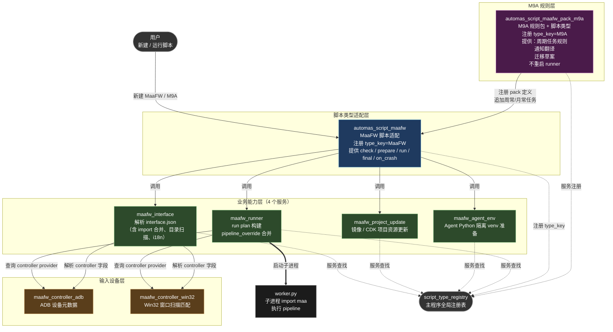

# MaaFW / M9A 插件适配审查报告

## 2026-07-07 二次核对结论

本轮已按 Bug #1-#24 逐项复核并补修。结论更新为：P0 已关闭，P1 已关闭或降级为维护项；当前仍需要真实 MaaFW/M9A 项目和前端手测作为发布验收，但报告内列出的阻塞性代码缺陷已处理。

### 新旧 M9A 双形态补充结论

本轮只记录该策略，不做前端入口和旧运行链路清理实现：

- 新 M9A 插件版本占用正式用户可见 `ScriptType=M9A`，新增脚本入口显示为 `M9A`，不加“插件版”标识。
- 旧 M9A 嵌入版本保留 `M9AConfig` / `M9AUserConfig` 和必要读取逻辑，只用于旧配置反序列化、只读展示、迁移入口和必要数据读取。
- 旧嵌入版本不得继续注册为可运行 `type_key="M9A"`；如果迁移期仍需在新增脚本或兼容选择处出现，显示名写为 `M9A（嵌入版）` 或 `旧 M9A（嵌入版）`。
- 迁移只创建新的 `PluginScriptConfig` / `PluginUserConfig`，设置 `Meta.PluginTypeKey = "M9A"`，不覆盖旧配置。
- 迁移完成并稳定后，再删除旧新增入口、旧运行链路和旧复杂编辑页。

### 逐项处理结果

| 编号 | 结论 | 处理说明 |
|---|---|---|
| #1 | 已修复 | `automas-script-maafw-pack-m9a` 注册独立 `type_key="M9A"`，底层复用 MaaFW hooks/runner。 |
| #2 | 已修复 | `/api/scripts/*` 支持 `PluginScriptConfig` / `PluginUserConfig`，索引兼容旧类名。 |
| #3 | 已修复 | M9A/MaaFW fallback `is_builtin=False`，`ScriptTypeDescriptor.available` 暴露离线回退状态。 |
| #4 | 已修复 | runner worker 在 `finally` 调用 `runner.shutdown()`，避免 Agent 子进程泄漏。 |
| #5 | 已修复 | `/maafw/asset` 必须指向可解析的 MaaFW interface 根目录，禁止 `.svg`。不强绑已保存脚本路径是为了支持新建/预览阶段。 |
| #6 | 已修复 | 下载阶段与 MirrorChyan 检查阶段均清洗 `cdk/token/password/api_key/secret`，并断开异常链。 |
| #7 | 已修复 | 主进程不再在 `_resolve_adb_path` 惰性导入 `maa.toolkit`。 |
| #8 | 已修复 | Win32 controller 限制正则长度、匹配文本长度，并拒绝嵌套量词。 |
| #9 | 已修复/降级 | `MaaFWRunner.prepare_agent_python_envs()` 已委派 `automas_maafw_agent_env.env.prepare_agent_envs`；runner 内保留的是运行子进程必需的 env 构造。 |
| #10 | 已修复 | project path 锁在 `main_task` 的 `finally` 中释放。 |
| #11 | 非发布阻塞 | entry-point 直接加载失败仍保留 warning；用户安装插件的主路径走插件管理器生命周期。后续可增加前端事件展示，不影响本轮发布门槛。 |
| #12 | 已修复 | `ScriptTypeRegistry.bootstrap()` 加锁，避免并发重复注册。 |
| #13 | 非 bug | 全量包为“覆盖新增”的加法语义是有意设计；删除旧文件应走 `changes.json` 增量包。 |
| #14 | 已修复 | 更新失败回滚后清理 `.mas-update/backup`。 |
| #15 | 已修复 | interface preview 只读 `.md/.markdown/.txt` 描述文件，不再原样返回 HTML。 |
| #16 | 非 bug | `Path.cwd()/data/cache` 符合 AUTO-MAS 便携数据目录约定；缓存有过期清理。改到用户目录会改变便携包语义。 |
| #17 | 非运行时 bug | embedded Agent 最终形态是隔离子进程，当前 `_load_embedded_agents()` 明确抛错，已移除 raise 后的不可达调用；剩余 legacy helper 可后续专门瘦身。 |
| #18 | 非发布阻塞 | `automas-script-maafw` 显式依赖 controller-win32；fallback 直接 import 是本地兜底，不是缺包风险。后续可继续收敛为纯 registry。 |
| #19 | 非 bug | M9A 插件注册独立脚本类型，完整复用 MaaFW interface/update/runner；`wants` 声明的是该类型运行所需能力，不是未消费依赖。 |
| #20 | 已补齐 | MaaFW 插件单测由 24 增至 28，覆盖 P0/P1 回归。真实运行与前端和 wheel 安装仍需手测。 |
| #21 | 非本轮 bug | 根 `pyproject.toml` 当前 `package=false`，发行真相源是 `res/version.json` 与 `app.core.config.VERSION`。版本同步可在发布流程单独治理。 |
| #22 | 已修复 | `MaaFWUserConfig._normalize_maafw_last_status` 同时兼容正确中文和旧错码状态。 |
| #23 | 已修复 | `/api/scripts/m9a/tasks/available` 增加 `M9AAvailableTasksIn/Out` 的 `response_model`，同时保留旧 query 参数兼容。 |
| #24 | 非本轮阻塞 | 前端硬编码映射是既有债务；本轮后端已给插件 schema/descriptor 兜底，前端注册表化可作为单独重构。 |

### 本轮新增验证

- `py -3.12 -m compileall ...`：通过。
- MaaFW 插件单测：`Ran 28 tests ... OK`。
- `app.api.scripts` 导入烟测：通过。
- `rg 'app\.task\.MaaFW|task/MaaFW|task\\MaaFW|app\\task\\MaaFW' app plugins tests pyproject.toml`：无命中。

> 下文保留原始审查正文，作为问题来源和背景记录；以上为二次核对结论，是当前最新状态。

- 分支：`feat/maafw-p`
- 审查日期：2026-07-07
- 当前版本：`res/version.json` = `v5.4.0-beta.1`，根 `pyproject.toml` = `5.2.0`
- 审查范围：插件系统基础设施 + 8 个 MaaFW/M9A 插件 + 前端集成 + 已有审计文档
- 审查方式：静态代码审查（4 路并行子代理全文阅读 + 父代理交叉验证）

---

## 2026-07-07 修复状态

本报告最初列出的 P0/P1 已完成首轮代码修复，当前结论更新为：架构方向保持为插件化，但 M9A 不降级为普通 MaaFW 配置。安装 `automas-script-maafw-pack-m9a` 后，宿主会新增独立 `ScriptType=M9A`；该类型底层复用通用 MaaFW schema、hooks 与 runner，并通过 `project_pack=m9a` 消费 M9A 周/月规则、通知翻译和迁移入口。

本轮已修复：

- P0 #1：`pack-m9a` 继承 `ScriptAdapterPlugin` 并注册 `type_key="M9A"`。
- P0 #2：`app/api/scripts.py` 与 `app/models/schema.py` 支持 `PluginScriptConfig` / `PluginUserConfig`，旧 `/api/scripts/*` 不再因插件配置 KeyError 返回 500。
- P1：runner worker 退出时 `shutdown()`；`/maafw/asset` 校验 interface root 且禁 `.svg`；更新日志清洗 CDK/token；主进程不再导入 `maa.toolkit`；desktop controller 拒绝高风险正则；project path lock 在 `main_task` finally 中释放。

剩余发布门槛：仍需完成手工兼容验收和真实 MaaFW/M9A 项目运行验收，尤其是前端新建 M9A、任务队列编辑、资源更新、通知文案和旧 M9A 迁移入口。

---

## 一、执行摘要（给领导看的一段话）

本次 MaaFW 插件化把原本内嵌在主程序里的 MaaFW 执行逻辑拆成 8 个独立可安装的 Python 包（wheel），并新增了一个 M9A 包插件。M9A 由 pack 插件继续注册用户可见的独立 `ScriptType=M9A`，但其运行链路降为“MaaFW 项目 + M9A 规则包”，复用同一套 MaaFW hooks 与 runner。架构方向正确、代码组织清晰，路径安全校验整体扎实，但当前分支存在 2 个阻塞性问题，未解决前不建议对外发布。

1. **M9A 脚本类型未真正注册**：用户在前端“新建脚本”选 M9A 会直接报错；已有的 M9A 脚本只能加载、不能运行（[Bug #1](#bug-1)）。
2. **遗留 API 与插件 API 路径分裂**：`app/api/scripts.py` 仍用一张硬编码字典查脚本配置类，对插件注册的脚本类型会 `KeyError`，导致增删查改返回 500（[Bug #2](#bug-2)）。

另有 6 个 P1 级问题（Agent 子进程泄漏、本地图片接口可读任意目录、CDK 可能泄露、主进程被恶意正则卡死等）需在发布前修复。**结论：当前分支为阶段落地态，未通过任何兼容验收门，不具备发布条件。**

---

## 二、背景：为什么要做这次插件化

| 项目 | 旧形态 | 新形态 |
|------|--------|--------|
| MaaFW | 内嵌于 `app/task/MaaFW/`，与主程序紧耦合 | 拆为 8 个独立 wheel，主程序只保留插件框架 |
| M9A | 独立脚本类型 `M9A`，独立运行链路 | 仍注册独立 `ScriptType=M9A`，但由 pack 插件提供，底层复用 MaaFW runner |
| 主程序 | 同时维护 MAA/SRC/MaaEnd/M9A/MaaFW/HSR/General/Okww 多套运行链路 | 内建仅注册 SRC/MaaEnd/HSR/General 四类，其余由插件按需加载 |

业务价值：主程序体积下降、MaaFW 相关重依赖（`maa` 库）按需安装、社区可自行开发新脚本类型插件而无需改主程序。

---

## 三、插件系统实现方式（领导版）

### 3.1 插件如何被主程序发现

主程序在启动时扫描一个本地“插件仓库目录”（默认 `plugins/pypi/site-packages`），用 Python 标准库的 `importlib.metadata` 枚举所有声明了 `auto_mas.plugins` 入口点的包。每发现一个入口点，就加载它、实例化一个 `Plugin` 子类，并按生命周期回调（`on_start` / `on_stop`）驱动它。

> **名词解释**：入口点（entry point）是 Python 包通过 `pyproject.toml` 暴露的命名钩子，类似“插件插槽”。主程序按名字找到对应包并加载。

### 3.2 一个脚本类型插件做什么

一个脚本类型插件（比如 `automas_script_maafw`）主要做三件事：

1. **声明身份**：在 `on_start` 里向“脚本类型注册表”登记一个 `type_key`（如 `"MaaFW"`）、一个配置类、一个用户配置类、一个 manager 工厂。
2. **提供表单**：把脚本配置项和用户配置项描述成前端可渲染的 schema（字段名、类型、默认值、可选项）。
3. **桥接运行**：实现 `check / prepare / main_task / final_task / on_crash` 五个生命周期钩子，把任务调度转交给运行器（runner）。

### 3.3 注册表与“离线回退”

主程序维护一张全局的 `script_type_registry`，记录所有已注册的脚本类型。当用户从旧版本升级、但某个插件没装上时，注册表会用一张静态表 `LEGACY_SCRIPT_TYPE_METADATA` 构建一个**只读回退 provider**。

- 回退 provider 能让旧脚本配置在 UI 里继续可见、可编辑（避免用户数据丢失）。
- 但它的 manager 工厂被刻意做成“调用即抛异常”——**回退 provider 不能运行任务**，只能保住数据。

> **关键事实**：M9A 与 MaaFW 在 `LEGACY_SCRIPT_TYPE_METADATA` 里都被标记 `is_builtin=True`，但实际内建注册列表 `_register_builtin_providers` 只注册了 SRC/MaaEnd/HSR/General 四类。也就是说，**M9A/MaaFW 只在插件加载时才真正可用，没插件就只能离线回退**。

### 3.4 遗留 API 路径 vs 新插件 API 路径

主程序有两套并行的 API：

| 路径 | 用途 | 状态 |
|------|------|------|
| `/api/scripts/*`（旧） | 用一张硬编码字典 `SCRIPT_BOOK` 把配置类名映射到类 | 仅对四个内建类型有效，对插件类型必崩 |
| `/api/scripts2/*`（新） | 通过注册表感知插件 | 当前 MaaFW 插件脚本走这条 |

这两条路径目前是分裂的，是本次审查发现的最大架构债务。

### 3.5 插件依赖关系图

**怎么读这张图**：

- **粗实线** = 直接调用关系（`MaaFW` 适配器调用 4 个服务）
- **细实线** = 实际数据流（`runner` / `interface` 实际查询 controller）
- **虚线** = 注册/服务发现关系（plugin 与 registry）
- **加粗箭头** = 进程边界（`runner` 启动 worker 子进程）
- **M9A 包的位置**：它在 `MaaFW` 适配器旁注册自己，把“周常/月常”任务规则**注入**到 MaaFW 适配器的任务队列，自己不调用任何 service

**M9A 与 MaaFW 的关系**：M9A 仍是用户可见的独立脚本类型，但这个类型由 `pack-m9a` 插件注册，不由主程序内建注册。用户新建的是 `PluginTypeKey=M9A` 的插件脚本；运行时复用 MaaFW 适配器和 MaaFW runner，并通过 `project_pack=m9a` 查询 m9a pack 定义，把“周常/月常”规则合并进通用 MaaFW 配置。**M9A 有独立入口，没有自己的 runner**。

---

## 四、各插件实现概览

| 插件 | 提供能力 | 注册什么 | 主要方法 | 测试覆盖 |
|------|----------|----------|----------|----------|
| `automas_maafw_interface` | 解析 MaaFW `interface.json`（含 import 合并、目录扫描、i18n、缓存） | 服务 `maafw.interface.v1` | `load/preview/validate/build_default_snapshot/normalize_snapshot/rescan_option` | 1 个单元用例，仅 happy-path |
| `automas_maafw_project_update` | MaaFW 项目资源更新（mirrorchyan / github_release，全量/增量包） | 服务 `maafw.project_update.v1` | `list_providers/check_update/apply_update/update_if_needed` | 4 个用例（zip-slip 拒绝、回滚、增量、全量），未覆盖真实下载/CDK/SHA256 |
| `automas_maafw_agent_env` | MaaFW Agent Python 隔离 venv 规划与准备 | 服务 `maafw.agent_env.v1` | `classify/build_command_plans/prepare_env` | 4 个用例，mock subprocess |
| `automas_maafw_runner` | run plan 构建、pipeline_override 合并、worker 子进程执行 | 服务 `maafw.runner.v1` | `build_plan/create_job_payload/write_job_file/run_worker` | 2 个用例，mock Popen，未覆盖真实 MaaFW 执行 |
| `automas_maafw_controller_adb` | ADB controller 元数据（不启动 ADB 进程） | 服务 `maafw.controller.adb` + 向 registry 注册 controller provider | `get_provider_definition/build_device_spec` | 1 个用例，验证 device spec 输出 |
| `automas_maafw_controller_win32` | Win32 窗口扫描与 controller 窗口匹配 | 服务 `maafw.controller.win32` | `list_windows/match_controller_windows/build_device_spec` | 2 个用例（mock 窗口实跑正则匹配） |
| `automas_script_maafw` | 把 MaaFW 注册为脚本类型，桥接 runner | 脚本类型 `type_key="MaaFW"` + 服务 `maafw.registry.v1` | `MaaFWAdapterHooks` 五生命周期 + `MaaFWPluginAutoProxyTask` | 仅测 3 个内部辅助函数，运行时生命周期**完全未测** |
| `automas_script_maafw_pack_m9a` | M9A 规则包（周期任务、通知翻译、迁移草稿） | 服务 `maafw.pack.m9a.v1` + 向 registry 注册 pack | `get_definition/translate_notification/create_migration_draft` | 3 个用例（definition/notification/migration） |

---

## 五、Bug 清单

> 严重度定义：**P0** 阻塞发布 / **P1** 发布前必修 / **P2** 健壮性与维护性 / **P3** 风格与文档

### P0 — 阻塞发布

#### Bug #1：M9A 脚本类型未注册，新建/运行 M9A 直接失败 

- **位置**：`plugins/automas_script_maafw_pack_m9a/src/automas_script_maafw_pack_m9a/plugin.py:18-44`；`app/core/script_types.py:69-77`
- **现象**：m9a pack 插件只注册了 `maafw.pack.m9a.v1` 服务，**没有**注册 `type_key="M9A"`。`app/core/script_types.py` 的 `_register_builtin_providers` 也只注册 SRC/MaaEnd/HSR/General 四类。M9A 只存在于 `LEGACY_SCRIPT_TYPE_METADATA` 静态表里。
- **影响**：
  - 前端“新建脚本”选 M9A 时，后端 `script_type_registry.get("M9A")` 抛 `KeyError` 或 500 错误。
  - 已有的旧 M9A 脚本能加载（走离线回退），但 manager 工厂被刻意做成抛 `RuntimeError("脚本类型 M9A 当前未启用，无法创建任务管理器")` ——**能看不能跑**。
- **建议**：二选一——
  1. m9a pack 插件显式注册 `type_key="M9A"`（继承 `ScriptAdapterPlugin`，复用 MaaFW hooks）；
  2. 前端移除“新建 M9A 脚本”入口，引导用户走 `create_migration_draft` 迁移到 MaaFW+m9a pack，并在文档中明确告知。
- **佐证**：前端 `frontend/src/utils/scriptRegistry.ts:71` 的 `BUILTIN_SCRIPT_TYPES` 仍把 `M9A` 列为内建，与后端实际行为不符。

#### Bug #2：遗留 `SCRIPT_BOOK` 不含 `PluginScriptConfig`，插件脚本增删查改必崩 

- **位置**：`app/api/scripts.py:105-124`（`SCRIPT_BOOK` / `USER_BOOK` 硬编码 8 个遗留类名）；`app/api/scripts.py:138, 163, 342-344, 369`
- **现象**：`Config.add_script` / `Config.get_script` 对非内建 provider 返回 `PluginScriptConfig` 实例，`type(config).__name__ == "PluginScriptConfig"`。`SCRIPT_BOOK` 没有这个键，`SCRIPT_BOOK[type(config).__name__]` 抛 `KeyError`。
- **影响**：通过 `/api/scripts/add`、`/api/scripts/get`、`/api/scripts/user/get`、`/api/scripts/user/add` 操作任何插件脚本（含 MaaFW 插件形态）都会返回 500。当前 MaaFW 插件脚本走 `/api/scripts2/*` 绕开了此问题，但只要前端任何路径误调旧接口、或 legacy MaaFW 脚本被误标为 plugin 类型，就会炸。
- **建议**：让 `SCRIPT_BOOK` / `USER_BOOK` 路径完全退役，`add_script` / `get_script` 改用 `script_type_registry` + `build_descriptor` 返回中立的 schema 数据；或者在 `SCRIPT_BOOK` 中补 `"PluginScriptConfig": PluginScriptConfig` 并在响应模型中区分 plugin 容器。

### P1 — 发布前必修

#### Bug #3：`is_builtin` 在离线回退与插件加载两种状态下取值相反

- **位置**：`app/core/script_types.py:69-87`（M9A/MaaFW 元数据 `is_builtin=True`）vs `plugins/automas_script_maafw/src/automas_script_maafw/plugin.py:49`（`is_builtin=False`）
- **现象**：同一个 `type_key`，插件未加载时回退 provider 的 `is_builtin=True`，插件加载后真实 provider 的 `is_builtin=False`。
- **影响**：影响 `Config.add_script` 的分支选择与前端类型属性判断，可能让前端误判 M9A 是内建而提供错误的入口。
- **建议**：统一 fallback 元数据中 `is_builtin` 的语义（建议设为 `False`），并通过 `build_descriptor` 暴露 `available` 字段让前端识别“离线回退”状态。

#### Bug #4：runner worker 退出时不清理 Agent 子进程，导致进程泄漏

- **位置**：`plugins/automas_maafw_runner/src/automas_maafw_runner/worker.py:59-61`；`plugins/automas_maafw_runner/src/automas_maafw_runner/runner.py:421-465, 794-801`
- **现象**：`MaaFWRunner.run()` 的 `finally` 仅停日志尾巴，不调 `shutdown()`；`worker.py:main()` 在 `run()` 返回后直接退出进程；`_start_agents` 启动的 Agent 子进程用了 `CREATE_NO_WINDOW` 但没有 Job Object。
- **影响**：Windows 上父进程退出后 Agent 子进程变孤儿，持续占用端口和资源。多次运行后机器上会堆积 maa 进程。
- **建议**：在 `run()` 的 `finally` 中调用 `self.shutdown()`，或在 `worker.py:main()` 的 `run()` 后显式 `runner.shutdown()`。

#### Bug #5：`/maafw/asset` 端点 `root` 参数未校验，可读取任意目录图片

- **位置**：`app/api/scripts.py:954-974`；`app/api/scripts.py:68-89`
- **现象**：`_maafw_asset_file_path` 只校验 `root` 是存在的目录，未校验其是否为已注册的 MaaFW 项目路径。后缀白名单含 `.svg`。
- **影响**：本机任意网页/脚本可通过 `GET /api/scripts/maafw/asset?root=C:\Users\X\Pictures&path=photo.png` 读取用户机器上任意图片；`.svg` 若前端直接渲染还有 XSS 风险。
- **建议**：将 `root` 限制为已注册脚本配置中的 `Info.Path`，并加 Origin/CSRF 校验。

#### Bug #6：`project_update` 异常链可能泄露 MirrorChyan CDK

- **位置**：`plugins/automas_maafw_project_update/src/automas_maafw_project_update/updater.py:230-249, 341, 369-390, 820-836`
- **现象**：CDK 以 query param `cdk=...` 拼入 URL。`_sanitize_log_message` 只对 `download_url` 日志脱敏，但 `_stream_update_package` 抛出的 `MaaFWProjectUpdateError` 不经脱敏。
- **影响**：若 httpx 在异常信息里包含完整 URL（含 `?cdk=...`），CDK 会随异常链进入 `send_log` 与上层日志，可能写入用户日志文件或推送通知。
- **建议**：在 `_check_mirrorchyan_update` 与 `_stream_update_package` 的所有异常分支统一走 `_sanitize_log_message`。

#### Bug #7：`runner_task._resolve_adb_path` 在主进程惰性导入 `maa.toolkit`

- **位置**：`plugins/automas_script_maafw/src/automas_script_maafw/runner_task.py:387-393`
- **现象**：`with suppress(Exception): from maa.toolkit import Toolkit; ...`。`suppress(Exception)` 把 ImportError 也吞了。
- **影响**：违反“主进程不加载 maa”的导入边界（`test_maafw_import_boundaries.py` 只校验导入时，不覆盖此运行时路径）。无 `maa` 环境下 ADB 自动发现**无声失效**，用户只看到“无法找到 ADB 路径”，难定位。
- **建议**：把 ADB 设备发现移入 runner worker 子进程，或在 `suppress` 外显式捕获 `ImportError` 并 `logger.warning`。

#### Bug #8：`controller_win32` 正则匹配无超时保护，存在 ReDoS 风险

- **位置**：`plugins/automas_maafw_controller_win32/src/automas_maafw_controller_win32/service.py:116-122`
- **现象**：`re.search(pattern, value)`，`interface.json`（不可信外部输入）提供的 `class_regex`/`window_regex` 无超时。
- **影响**：恶意或错误的 MaaFW 项目可构造灾难性回溯模式冻结主进程。ReDoS 不抛异常，会卡死。
- **建议**：对窗口类名/标题长度做上限校验（先截断到 256 字符），或限制正则模式长度。

#### Bug #9：`runner.py` 与 `agent_env/env.py` 大量代码重复，存在漂移风险

- **位置**：`plugins/automas_maafw_runner/src/automas_maafw_runner/runner.py:240-1803` vs `plugins/automas_maafw_agent_env/src/automas_maafw_agent_env/env.py`
- **现象**：`_load_project_agent_requirements`、`_build_agent_env_manifest`、`_venv_python_path`、`_check_pip_health`、`_try_ensurepip`、`_pip_install`、`_should_rebuild_isolated_venv`、`_ensure_isolated_venv` 等十多个函数几乎逐行重复。`MaaFWRunner.prepare_agent_python_envs` 走自身重复实现，而模块级 `prepare_maafw_agent_python_envs` 却优先委派 `MaaFWAgentEnvService`。
- **影响**：两套实现一旦单独修改就会出现行为分歧，是中期最大维护隐患。
- **建议**：`MaaFWRunner` 直接复用 `automas_maafw_agent_env.env.prepare_agent_envs`，删除 `runner.py` 中的重复函数。

#### Bug #10：`project path 锁` 在 `main_task` 异常时可能泄漏

- **位置**：`plugins/automas_script_maafw/src/automas_script_maafw/runner_task.py:612-626, 217-219`
- **现象**：`main_task` 的 `finally` 只调 `_shutdown_runner` + `_close_emulator`，不释放 project path 锁；锁释放依赖 `final_task` 与 `on_crash`。
- **影响**：若 TaskManager 异常跳过 `final_task`（硬杀），`_RUNNING_PROJECT_PATHS` 集合中残留该路径，后续同路径脚本永远跳过。
- **建议**：在 `main_task` 的 `finally` 中也调用 `_release_project_path`，或改用 `try/finally` 上下文管理器封装锁。

### P2 — 健壮性与维护性

#### Bug #11：入口点加载异常被静默吞掉

- **位置**：`app/core/script_types.py:383-386`
- **现象**：`_load_entry_point_providers` 对每个 entry-point 的 `ep.load()` 与 `register()` 包了 `try/except Exception`，仅 `logger.warning`。
- **影响**：插件 provider 注册失败时用户只能从日志看到一个 warning，前端无信号。未来启用 `auto_mas.script_types` 直接入口后会成“安装成功但功能缺失”的隐性故障。
- **建议**：保留 warning，但同时通过事件总线广播一个 provider 加载失败信号，让前端可展示。

#### Bug #12：`bootstrap()` 非线程安全

- **位置**：`app/core/script_types.py:268-276`
- **现象**：`self._bootstrapped` 检查与赋值之间无锁。并发调用会让 `_register_builtin_providers` 抛 `ValueError("脚本类型 SRC 已存在")`。
- **影响**：当前调用方在启动期单线程执行，暂时不触发，但代码本身不防并发。
- **建议**：加 `threading.Lock` 保护 bootstrap 区段。

#### Bug #13：`project_update` 全量包应用为“加法”语义，旧文件不清理

- **位置**：`plugins/automas_maafw_project_update/src/automas_maafw_project_update/updater.py:516-533`
- **现象**：`_apply_full_package` 仅覆盖新增，不删除项目中已存在但包中没有的文件。测试显式确认 `obsolete.txt` 保留。
- **影响**：多版本累积可能残留过期资源。
- **建议**：文档明确“全量即加法”，或提供清理模式选项。

#### Bug #14：`project_update` 失败后 `backup_dir` 残留

- **位置**：`plugins/automas_maafw_project_update/src/automas_maafw_project_update/updater.py:480-578`
- **现象**：`finally` 删除 `extract_dir` 与 `package_path`，但 `backup_dir` 仅在成功时删除；失败回滚后不删 `backup_dir`。
- **影响**：`.mas-update/backup` 残留目录累积。
- **建议**：在 `_restore_incremental_backup` 末尾删除 `backup_dir`。

#### Bug #15：`interface` preview `resolve_description` 读取 HTML 原样返回，XSS 风险

- **位置**：`plugins/automas_maafw_interface/src/automas_maafw_interface/preview.py:204-217`
- **现象**：`.html/.htm` 文件被原样读为 description 返回前端。路径已限项目内、大小限 12KB，但内容未净化。
- **影响**：恶意 MaaFW 项目包含恶意 HTML，前端若用 `v-html` 渲染会造成 XSS。
- **建议**：前端对 description 文本做转义，或后端只返回 `.md/.txt`。

#### Bug #16：`interface` 磁盘缓存目录绑定 `Path.cwd()`

- **位置**：`plugins/automas_maafw_interface/src/automas_maafw_interface/loader.py:679-680`
- **现象**：`_disk_cache_dir()` 返回 `Path.cwd() / "data/cache/maafw_interface_loader"`。
- **影响**：启动 CWD 变化时旧缓存无法被清理流程发现，产生孤儿缓存。
- **建议**：改用固定用户数据目录。

#### Bug #17：`runner._load_embedded_agents` 存在大量不可达死代码

- **位置**：`plugins/automas_maafw_runner/src/automas_maafw_runner/runner.py:844-1228`
- **现象**：`planner.py:89-94` 已将 embedded agent 转为隔离子进程，`_load_embedded_agents` 在 848 行无条件 `raise RuntimeError`，后续约 380 行 embedded 加载/扫描/装饰/patch 代码均不可达。
- **建议**：删除死代码或加 `# pragma: no cover` 与说明注释。

#### Bug #18：插件间 peer-import 绕过服务注册

- **位置**：`plugins/automas_maafw_controller_win32/src/automas_maafw_controller_win32/service.py:8`（直接 import `automas_maafw_interface.models`）；`plugins/automas_script_maafw/src/automas_script_maafw/runner_task.py:679`（直接 import `automas_maafw_controller_win32.service`）
- **现象**：插件间直接 import，绕过 `maafw.registry.v1` 服务查找。`runner_task.py:675-682` 优先走 registry，失败才 fallback 到直接 import，但 fallback 路径硬编码了具体插件类名。
- **影响**：插件被重命名/替换后 fallback 路径会断。
- **建议**：将 fallback 改为通过 registry 查询，移除硬编码 import。

#### Bug #19：`m9a pack` 的 `wants` 列表声明了未消费的服务

- **位置**：`plugins/automas_script_maafw_pack_m9a/pyproject.toml:11-14` vs `plugins/automas_script_maafw_pack_m9a/src/automas_script_maafw_pack_m9a/plugin.py:20-25`
- **现象**：`wants = ["maafw.registry.v1", "maafw.interface.v1", "maafw.project_update.v1", "maafw.runner.v1"]`，但 `service.py` 实际只用 `maafw.registry.v1`。
- **影响**：多余声明是软依赖（不影响加载），但会误导维护者。
- **建议**：精简 `wants` 至实际消费的 `maafw.registry.v1`。

#### Bug #20：测试覆盖严重不足

- **位置**：`tests/plugins/test_maafw_*.py`
- **现象**：
  - `interface`：无 malformed JSON、循环 import、import 路径越界、disk cache 命中/失效、`rescan_option`、`validate` 用例。
  - `project_update`：无下载重试、SHA256 不匹配、CDK 脱敏、MirrorChyan/GitHub API mock 用例。
  - `agent_env`：无 venv 重建、pip 健康检测失败、ensurepip 失败、external agent 用例。
  - `runner`：无 Agent 进程启动/清理、设备连接失败、任务失败继续、`shutdown()` 资源释放用例。
  - `script_maafw`：`runner_task.py` 运行时生命周期**完全未测**，仅测 3 个内部辅助函数。
  - `test_maafw_import_boundaries.py`：仅校验导入时边界，不覆盖运行时 `maa.toolkit` 加载（Bug #7）。
- **建议**：补齐上述用例，至少覆盖 P1 问题的回归路径。

### P3 — 已知遗留问题（来自既有审计文档，未修复）

#### Bug #21：版本号不一致

- `res/version.json` = `v5.4.0-beta.1`，根 `pyproject.toml` = `5.2.0`，`plugins/auto_mas_core/pyproject.toml` = `5.2.0`。`check-version-json.yml` 不校验 `pyproject.toml` 同步。
- 来源：`docs/maafw-plugin-code-audit.md §8.1`

#### Bug #22：`MaaFWUserConfig` 的 GBK 乱码映射

- **位置**：`app/models/config.py:2200-2208`
- **现象**：`{"鏈煡": "未知", "鎴愬姛": "成功", "澶辫触": "失败", "杩愯": "运行中"}` 是 GBK 字节被 UTF-8 误读的乱码，用来对齐旧 MaaFW 输出的中文状态字符串。
- **影响**：依赖乱码字符串匹配，旧 MaaFW 输出编码变化即失效。
- **建议**：改为按字节匹配或上游修复编码。

#### Bug #23：M9A endpoint 风格不一致

- **位置**：`app/api/scripts.py:644-692`（`/api/scripts/m9a/tasks/available`）
- **现象**：无 `response_model`、无 `*In/*Out` schema、用 query 参数，与本仓其它端点用 `Body(...)` + `*In/*Out` 风格不一致。
- **来源**：`docs/maafw-plugin-code-audit.md §8.2`

#### Bug #24：`useScriptApi.getScriptsWithUsers` 的 1000 行硬编码字段映射

- **来源**：`docs/maafw-plugin-code-audit.md §8.8`
- **建议**：迁到注册表驱动。

---

## 六、已有审计文档状态

仓库 `docs/` 下已有 8 个 MaaFW 插件化相关文档（计划/契约/审计/清单）。汇总状态：

| 文档 | 性质 | 关键结论 | “可发布”判定 |
|------|------|----------|--------------|
| `maafw插件化最终实现方案.md` | 最终实现方案（自称唯一评审入口） | 8 wheel 已构建，MaaFW 通用插件化已落地，3 项主要风险及处理策略 | “阶段落地态”，未说 ready |
| `maafw插件化首批落地评审.md` | 首批落地代码评审 | 8 wheel 可构建，`app.task.MaaFW` 0 命中，24 单测通过；列 5 个 open review 重点 | 未给整体 ready |
| `maafw-plugin-code-audit.md` | P0 代码事实盘点 | P0 契约落 3 文件内，无 maa 依赖；列 10 项可关注点 | 未给 ready |
| `maafw-plugin-compatibility-gate.md` | 兼容验收门 | 7 个 old/new 对照验收门，**全部“待执行”** | **未通过验收** |
| `maafw-plugin-p0-contract.md` | P0 服务契约草案 | 冻结 7 个 v1 服务，1 项待人工确认 | 待人工审 |
| `maafw-plugin-p0-learning-guide.md` | P0 学习指南 | 解释三进程模型，interface 包冻结最小集 | — |
| `maafw-plugin-p1-checklist.md` | P0/P1 任务清单 | P0-1/P0-2/P0-3 已完成，P0-4/P0-5 待人工确认，P1 全部未开始 | 未开始 |
| `maafw-interface-parser-for-maaend.md` | MaaEnd 专项接入说明 | MaaEnd 只接 `maafw.interface.v1`，不复制 loader | — |

### 6.1 文档间主要矛盾

**pack 默认值口径**：

- `maafw-plugin-p0-contract.md §7.1` 的 `MaaFWProjectPackDefinition` 中显式列出 `default_controller`、`default_resource`、`default_preset`、`default_task_queue`。
- `maafw插件化最终实现方案.md §6.3、§7、§13 P5 验收` 已统一为：M9A pack 可以声明默认项目来源、默认 controller/resource/preset、默认任务队列和周期规则。
- `maafw-plugin-code-audit.md §3.4` 与 `maafw-plugin-p1-checklist.md §3.4` 中“M9A 默认任务队列和模板应作为 pack-m9a 的预设输入提前填写”的口径与当前实现一致。

结论：这里不再按“pack 不声明默认值”审查。正确边界是默认值属于 `pack-m9a` metadata，不允许写入通用 MaaFW 层，也不允许因此复制 M9A 专属 runner。

### 6.2 文档覆盖盲区

既有文档**未覆盖**以下区域，本报告已补审计：

- emulator 服务层（`app/services/emulator`）——`p1-checklist §1 P0-5` 自承未审计，至今未补。
- 线程/异步并发安全（多插件实例并发、ServiceRegistry 并发、worker 子进程并发）。
- 安全面（wheel 来源校验、CDN/镜像完整性、`Password`/`MirrorChyanCDK` 加密在迁移后的处理、前端 `v-html` XSS）。
- `m9a pack` 插件的代码级事实评审（既有文档只在 `review §4` 描述意图，未给代码事实）。
- 前端 `PluginFrontendLoader` / `PluginElementHost.vue` / `PluginPageHost.vue` 在 MaaFW 插件前端资产装载时的具体行为、HMR、跨 iframe 通信。
- 实际 wheel 内容审计、`manifest.json` 字段实测、风味包在线安装清单与 hash/锁文件实测。

---

## 七、风险评估与发布建议

### 7.1 风险矩阵

| 风险 | 概率 | 影响 | 综合等级 |
|------|------|------|----------|
| 用户新建 M9A 失败（Bug #1） | 高（前端仍展示 M9A 入口） | 用户无法使用 M9A | **极高** |
| 插件脚本增删查改 500（Bug #2） | 中（当前 MaaFW 走新 API 绕开） | 用户操作失败 | **高** |
| Agent 子进程泄漏（Bug #4） | 高（每次运行都触发） | 机器资源耗尽 | **高** |
| 本地图片接口读任意目录（Bug #5） | 中（需本机有恶意网页） | 本地信息泄露 | **高** |
| CDK 泄露（Bug #6） | 低（需下载异常） | 密钥泄露 | **中高** |
| ReDoS 卡死主进程（Bug #8） | 低（需恶意项目） | 主程序卡死 | **中高** |
| project path 锁泄漏（Bug #10） | 中（需 TaskManager 硬杀） | 同路径脚本永久跳过 | **高** |
| 代码重复漂移（Bug #9） | 高（已存在） | 长期维护成本 | **高** |

### 7.2 发布建议

**当前分支不具备发布条件**。建议按以下顺序处理：

1. **发布前必做（P0/P1）**：修复 Bug #1、2、4、5、6、7、8、10。其中 Bug #1 与 #2 是阻塞项，必须二选一并落地。
2. **发布前应做**：补齐 Bug #20 中针对 P1 问题的回归测试；执行 7 个兼容验收门（`maafw-plugin-compatibility-gate.md` 列出的全部“待执行”项）。
3. **发布后短期**：修复 Bug #9（代码重复）、#3（`is_builtin` 语义）、#11、#19（健壮性）。
4. **中期**：解决文档矛盾（§6.1）、清理 `app/task/M9A/**` 旧目录（评审文档明确保留用于迁移，迁移完成后删除）、补 emulator 服务审计。

### 7.3 总体健康度

- **架构方向**：正确。插件化、M9A 由 pack 提供独立 `ScriptType=M9A` 且复用 MaaFW runner、主程序瘦身，方向符合长期演进。
- **代码质量**：整体清晰，路径校验扎实，但有 2 个 P0 阻塞、6 个 P1 风险，且测试覆盖严重不足。
- **文档完备度**：计划/契约文档详尽，但存在矛盾，且代码级事实审计不完整。
- **可发布性**：未通过任何兼容验收门，不建议对外发布。

---

## 八、术语表

| 术语 | 含义 |
|------|------|
| 入口点（entry point） | Python 包通过 `pyproject.toml` 暴露的命名钩子，主程序按名字发现并加载插件 |
| Provider（提供者） | `ScriptTypeProvider` 实例，封装某类脚本的配置类、schema、manager 工厂 |
| Registry（注册表） | `script_type_registry` 单例，按 `type_key` / 配置类名索引所有 provider |
| Fallback（离线回退） | 插件未加载时用静态表构建的只读 provider，仅能展示/编辑，不能运行任务 |
| Builtin（内建） | `is_builtin=True` 的 provider，由主程序直接注册（当前仅 SRC/MaaEnd/HSR/General） |
| `interface.json` | MaaFW ProjectInterface V2 配置文件，声明 controller/resource/task/option/preset/agent |
| pipeline | MaaFW 任务执行图，`pipeline_override` 是按 option/case 合并进任务 entry 的覆盖片段 |
| controller | MaaFW 输入捕获方式（`Adb`/`Win32` 等），决定截图与触控方法 |
| agent venv | 为 MaaFW Agent Python 脚本创建的隔离虚拟环境，分 project_python / isolated_venv / external 三类 |
| mirror / CDK | MirrorChyan 资源分发平台的下载密钥，用于鉴权与限流 |
| pack | MaaFW 项目之上的规则包（如 m9a pack 提供周期任务规则、通知翻译、迁移草稿） |
| wheel | Python 包的二进制分发格式，本项目的插件以 wheel 形式独立安装 |
| P0/P1/P2/P3 | 严重度分级：P0 阻塞发布 / P1 发布前必修 / P2 健壮性 / P3 风格与文档 |

---

## 附录：审查方法与覆盖范围

- **审查方式**：4 路并行子代理全文阅读 + 父代理交叉验证。
  - 子代理 A：插件系统基础设施（`app/core/script_types.py` + `app/plugins/` 35 个模块 + `app/api/scripts.py`）。
  - 子代理 B：4 个 MaaFW 业务插件（interface / project_update / agent_env / runner）及对应测试。
  - 子代理 C：2 个 controller 插件 + script_maafw 适配器 + m9a pack 插件 + 前端 8 个 Vue/TS 文件 + 测试。
  - 子代理 D：8 份既有审计/计划文档 + `res/version.json`。
- **未覆盖**：运行时行为（未启动主程序实测）、真实 wheel 内容、`maa` 库实际执行链路、Electron renderer 前端资产装载实测、emulator 服务层（既有文档亦未覆盖）。
- **审查局限**：本报告基于静态代码审查，Bug #1/#2/#4/#10 等运行时行为需通过实际启动主程序并执行 MaaFW/M9A 任务验证。
