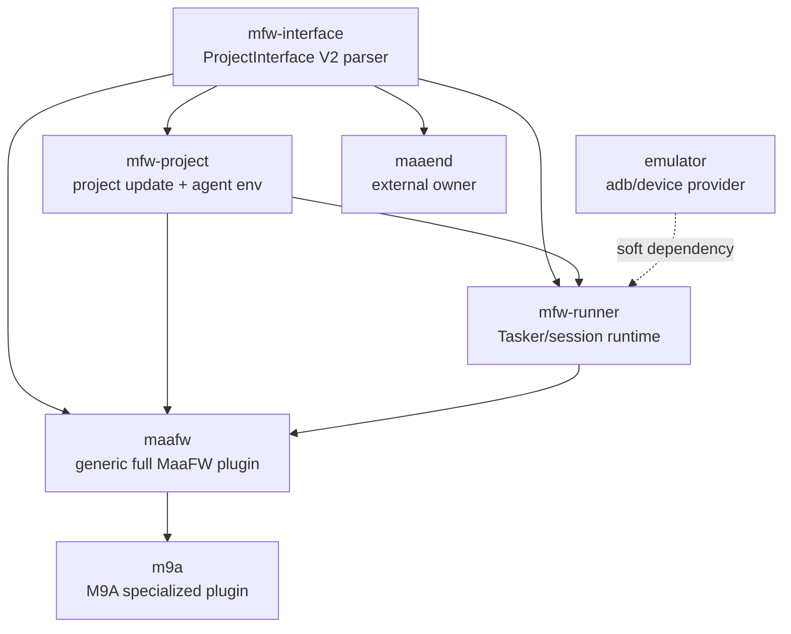

# MaaFW 插件化拆分与 M9A 直控适配方案

本文只给方案，不落实现。目标是把当前内置在主程序里的 MaaFW 能力拆成可被多个插件消费的基础插件，同时让 M9A 专项和 MaaFW 通用能力一起完成插件化。

## 0. 输入与现状判断

参考输入：

- AUTO-MAS 插件开发文档：<https://doc.auto-mas.top/plugin/start/develop.html>
- MaaFramework ProjectInterface V2：<https://maafw.com/docs/3.3-ProjectInterfaceV2>
- MaaFramework 快速开始：<https://maafw.com/docs/1.1-QuickStarted>
- 可参考生态：MXU、MWU、MFAAvalonia、MFW-PyQt6
- 本地参考目录：`D:\maafwin`
- 本地 PDF：`C:\Users\qiyin\Downloads\maafw-plugin-ecosystem-and-m9a-adaptation.pdf`

环境限制说明：本机没有 `pdftotext`、`pypdf`、`PyPDF2`、`pdfminer`、`fitz` 等 PDF 文本抽取工具，轻量解析该 PDF 时只能读到 Skia/Chrome PDF 的字体编码流，未能可靠还原正文。因此本文不逐字引用 PDF 内文，主要依据本仓代码、`D:\maafwin` 中可读的 M9A/MaaEnd 发行目录，以及上述公开方案方向整理。

本仓现状：

- 插件发现走 Python entry point，入口组为 `auto_mas.plugins` / `automas.plugins`。
- 插件运行时通过 `PluginContext` 暴露 `service`、`server`、`page`、`event`、`cache`、`runtime` 等能力。
- 插件前端已经支持 custom element 形态，通过 `frontend/manifest.json` 加载。
- `plugins/okww_adapter` 已经演示了脚本适配插件注册 `ScriptAdapterDefinition` 的方式。
- `app/task/MaaFW` 当前已经包含几类不同职责：ProjectInterface 解析、任务快照归一化、run plan 构造、MaaFW runner、agent 环境准备、项目更新、窗口/控制能力、AUTO-MAS 任务生命周期。
- `D:\maafwin\M9A-win-x86_64-v3.20.1` 是 MFAAvalonia/MFAA 线：有 `interface.json`，同时有 `config/instances/default.json` 中的 `CurrentTasks`、`TaskItems`、ADB/PC controller 配置。
- `D:\maafwin\MaaEnd-win-x86_64-v1.16.0-beta.1` 是 MXU 线：有 `interface.json`、`config/mxu-MaaEnd.json`、`__MXU_*` 任务语义。

## 1. 总体原则

1. 拆分按“消费契约”拆，不按当前目录机械切。
2. ProjectInterface V2 是最低层稳定契约，必须独立成插件，供 MaaEnd、M9A、通用 MaaFW 等不同上层消费。
3. 通用 MaaFW 插件只负责 MaaFramework 项目的通用解析、运行、项目更新和泛用 UI，不写入 M9A、MaaEnd 的业务任务策略。
4. M9A 专项由你负责，应和 MaaFW 通用插件一起推进，但 M9A 的周任务、月任务、通知、默认队列、游戏特调留在 M9A 插件。
5. MaaEnd 专项不由你负责；你只需要交付可被 MaaEnd 插件消费的通用 interface 解析服务。
6. emulator/ADB 能力归模拟器插件所有。MaaFW runner 不应重复实现 MuMuManager `adb -v` 拉 adb 的逻辑，只消费 emulator 服务返回的 adb 路径、地址、实例和扩展能力。

## 2. 推荐插件拆分

建议拆成 4 个基础插件 + 2 个应用插件。基础插件尽量 headless，应用插件才注册脚本类型和页面。

| 插件 | 定位 | 依赖 | 对外服务 | 不应承担 |
| --- | --- | --- | --- | --- |
| `automas-plugin-mfw-interface` | ProjectInterface V2 解析器 | 无 | `mfw.interface.v1` | 运行 MaaFW、启动 agent、更新项目、M9A/MaaEnd 特调 |
| `automas-plugin-mfw-project` | MaaFW 项目与 agent 环境服务 | `mfw.interface.v1` | `mfw.project.v1`、`mfw.agent.v1` | 具体任务执行会话、游戏专项任务策略 |
| `automas-plugin-mfw-runner` | MaaFW 直控运行服务 | `mfw.interface.v1`、`mfw.project.v1`，软依赖 `emulator` | `mfw.runner.v1` | ProjectInterface 展示 UI、M9A/MaaEnd 专项配置 |
| `automas-plugin-maafw` | 完整通用 MaaFW 插件 | 上述三者 | `maafw.full.v1`，注册 `ScriptType=MaaFW` | M9A 专用周/月任务、MaaEnd MXU 配置 |
| `automas-plugin-m9a` | M9A 专项插件 | `maafw.full.v1` 或基础三服务 | 注册 `ScriptType=M9A`、M9A 页面/计划/通知 | 通用 PI V2 解析器、通用 runner 细节 |
| `automas-plugin-maaend` | MaaEnd 专项插件，非本阶段你负责 | 至少 `mfw.interface.v1` | MaaEnd 自己的脚本类型/页面 | 由你维护 MaaEnd 特调 |

### 2.1 `mfw-interface`

这是最应该先拆的插件，也是 MaaEnd 可消费的唯一通用交付物。

职责：

- 读取 `interface.json` / `interface.jsonc`。
- 支持 `import` 合并、循环导入检测、冲突检测。
- 支持 `scan_select` 扫描。
- 支持 i18n 字段解析和安全路径限制。
- 归一化 `controller`、`resource`、`agent`、`task`、`option`、`group`、`preset`。
- 输出稳定 DTO，不暴露 Pydantic 内部模型给跨插件调用方。
- 提供预览数据：项目基础信息、controller/resource/task/option/preset 摘要、默认任务快照。

建议服务接口：

```text
mfw.interface.v1.load_project(path, force_reload=False) -> InterfaceModel
mfw.interface.v1.preview(path) -> InterfacePreview
mfw.interface.v1.build_default_snapshot(interface, preset=None) -> TaskSnapshot
mfw.interface.v1.normalize_snapshot(interface, snapshot) -> TaskSnapshot
mfw.interface.v1.normalize_execution_payload(interface, task_names, task_options, controller, resource) -> ExecutionPayload
mfw.interface.v1.rescan_option(path, option_name) -> OptionCases
```

边界：

- 不启动任何 MaaFW tasker。
- 不读写 AUTO-MAS 用户配置。
- 不直接依赖 emulator、Notify、TaskManager。
- 不包含 M9A/MaaEnd 任务名白名单。

### 2.2 `mfw-project` 与 `mfw-agent`

`agent` 这个词在 MaaFramework 里容易和 AUTO-MAS 插件 agent 混淆，建议实现上放在同一个项目服务插件中，对外分两个 service namespace：

- `mfw.project.v1`：项目包、版本、更新源、MirrorChyan、全量/增量包应用。
- `mfw.agent.v1`：解析 PI V2 `agent` 声明、准备 Python 隔离环境、生成 agent command plan。

职责：

- 根据 `interface.mirrorchyan_rid` / `mirrorchyan_multiplatform` 检查更新。
- 安全下载和应用更新包，限制路径越界。
- 解析 `agent.child_exec` / `child_args`。
- 对项目自带 Python、项目可执行文件、隔离 venv、外部命令进行分类。
- 创建并维护项目专属 agent venv，避免污染 AUTO-MAS 主进程环境。

关键边界：

- `mfw.agent.v1` 只“准备环境和命令计划”，不长期持有 agent 子进程。
- agent 子进程的启动、连接、终止属于 runner 会话生命周期，留给 `mfw-runner`。
- 项目更新只处理 MaaFW 项目目录，不处理 M9A/MaaEnd 用户侧配置。

建议服务接口：

```text
mfw.project.v1.check_update(project_path, interface, channel, mirror_cdk) -> UpdateCandidate
mfw.project.v1.apply_update(project_path, candidate) -> UpdateResult
mfw.project.v1.update_if_needed(project_path, interface, options) -> UpdateResult

mfw.agent.v1.build_command_plans(project_path, interface.agent) -> AgentPlan[]
mfw.agent.v1.prepare_envs(project_path, interface.agent) -> AgentEnvResult
```

### 2.3 `mfw-runner`

runner 是真正的 MaaFramework 直控执行层。

职责：

- 根据 interface、controller、resource、任务快照构造 run plan。
- 连接 ADB / Win32 controller。
- 通过 MaaFW Python binding 创建 Resource、Controller、Tasker。
- 启动并连接 agent 子进程。
- 投递 task，收集日志、失败事件、completed task。
- 支持停止、清理、重试。
- 通过事件/日志服务向上层报告运行状态。

建议服务接口：

```text
mfw.runner.v1.build_plan(project_path, interface, selection) -> RunPlan
mfw.runner.v1.prepare_runtime(project_path, interface) -> RuntimePrepareResult
mfw.runner.v1.create_session(run_plan, device, callbacks) -> SessionId
mfw.runner.v1.run(session_id) -> RunResult
mfw.runner.v1.stop(session_id) -> StopResult
mfw.runner.v1.dispose(session_id) -> None
```

`device` 输入应该是 runner 层的中性结构，例如：

```text
type = Adb | Win32
adbPath
address
hWnd
screencapMethods / inputMethods
config
```

ADB 来源要求：

- 如果需要模拟器实例，runner 通过 `emulator` 服务拿实例。
- MuMuManager `adb -v` 获取 adb 的行为属于 emulator 插件，runner 不直接调用 MuMuManager。
- runner 只接受解析后的 adbPath/address/capability。

### 2.4 `automas-plugin-maafw`

这是完整通用 MaaFW 插件，相当于“把基础服务组装成一个可用脚本类型”。

职责：

- 注册 `ScriptType=MaaFW`。
- 提供通用脚本编辑页和用户编辑页。
- 提供 ProjectInterface 预览、controller/resource 选择、任务快照编辑、项目更新按钮、runner 环境准备按钮。
- 处理 AUTO-MAS 任务生命周期：check/prepare/main/final/on_crash。
- 将周/月“一次性任务”作为通用 runner 策略保留时，只提供机制，不内置游戏任务判断。

关键边界：

- 可以有 `WeeklyOnceTasks` / `MonthlyOnceTasks` 这种通用机制，但默认值和具体任务列表由上层专项插件配置。
- 不写 M9A 的默认队列，不写 MaaEnd 的 `mxu-MaaEnd.json`。
- 不把泛用 UI 做成 MXU/MFAA 复刻；只做 AUTO-MAS 里可完成任务选择、运行、日志和配置的最小闭环。

## 3. 依赖关系



跨插件消费使用 `ctx.service`，避免直接 import 其他插件内部模块。插件类可以声明：

```text
provides = ["mfw.interface.v1"]
needs = ["mfw.interface.v1", "mfw.project.v1"]
wants = ["emulator"]
```

## 4. 与当前代码的迁移映射

| 当前位置 | 目标归属 |
| --- | --- |
| `app/task/MaaFW/interface_models.py` | `mfw-interface` |
| `app/task/MaaFW/interface_loader.py` | `mfw-interface` |
| `app/task/MaaFW/interface_preview.py` | `mfw-interface`，或 `maafw` 的 UI DTO 适配层 |
| `app/task/MaaFW/task_config.py` | 第一阶段放 `mfw-interface`，若后续多 UI 复用变多，再拆 `mfw-profile` |
| `app/task/MaaFW/run_plan.py` | `mfw-runner`，但依赖 `mfw-interface` 的 DTO |
| `app/task/MaaFW/runner.py` | `mfw-runner` |
| `app/task/MaaFW/project_updater.py` | `mfw-project` |
| `app/task/MaaFW/window_service.py` | `mfw-runner`，Win32 controller 子能力 |
| `app/task/MaaFW/control_capabilities.py` | `mfw-runner`，但 emulator capability 来源应向 emulator 服务靠拢 |
| `app/task/MaaFW/manager.py` / `AutoProxy.py` | `automas-plugin-maafw` 的脚本适配层 |
| `app/api/scripts.py` 中 MaaFW endpoints | 迁到对应插件 HTTP routes，主 API 只保留兼容期代理 |
| `app/models/schema.py` MaaFW API schemas | 插件 schema 或插件内部 DTO；主 schema 兼容期保留 |
| frontend MaaFW 页面 | `automas-plugin-maafw` custom element 前端 |

不要一次性把所有文件搬完。先把底层服务抽出来，并让主程序内置 MaaFW 仍能调用新服务；然后再把脚本类型和页面迁成插件。

## 5. M9A 专项设计

M9A 不应只是“另一个 MaaFW 项目实例”。它应该消费完整 MaaFW 服务，再叠加 M9A 自身规则。

M9A 插件职责：

- 注册 `ScriptType=M9A`。
- 使用 `mfw.interface.v1` 读取 M9A `interface.json`，生成可选任务、controller/resource、任务说明、option 元数据。
- 使用 `maafw.full.v1` 或 `mfw.runner.v1` 运行任务。
- 保留 M9A 专用队列 UI、默认任务组合、任务分组和游戏文案。
- 管理 M9A 自己的用户配置、任务快照、通知策略、运行后更新策略。
- 提供周任务/月任务的专项规则。

M9A 周/月任务建议：

- “周期完成记录”可以复用通用 MaaFW 的机制，例如按 task name 写 `weekly` / `monthly` period key。
- “哪些任务属于周任务/月任务”必须由 M9A 插件声明，不放在 `mfw-runner`。
- M9A 插件可以提供预设，例如日常、周常、月常、活动，但底层 runner 只看最终 run plan。
- 示例领域任务包括本地 M9A 默认实例中的“自动深眠”“自动醒梦”“银行购物”“领取奖励”等，但具体周/月归类应由 M9A 维护者按游戏版本确认。

通知建议：

- 通用 MaaFW 只产出结构化运行结果：完成任务、失败任务、错误摘要、日志路径、耗时。
- M9A 插件把结构化结果翻译成 M9A 用户能理解的通知标题和正文。
- 不要在 runner 里拼 M9A 文案。

M9A 与 MFAAvalonia 的关系：

- 发行包中存在 MFAAvalonia 风格的 `config/instances/default.json`、`CurrentTasks`、`TaskItems`。
- AUTO-MAS 后续直控应把这些视为兼容/导入来源，而不是必须依赖外部 Avalonia GUI。
- 最终目标是 AUTO-MAS M9A 插件直接使用 `interface.json` 和 MaaFW runner 运行任务。

## 6. MaaEnd 边界

MaaEnd 是 MXU 线，不能强行塞进 M9A 的 MFAA 形态。

你负责的通用交付：

- `mfw.interface.v1` 能正确解析 MaaEnd 的 PI V2 `interface.json`、imports、tasks、options、agents。
- 解析输出不含 M9A 专项字段。
- 输出足够让 MaaEnd 插件维护者构建自己的 UI/配置。

不建议你负责的内容：

- `config/mxu-MaaEnd.json` 的完整读写策略。
- `__MXU_*` 内置任务语义。
- MaaEnd 计划表和 Skyland/终末地业务 Section。
- MaaEnd 外置 MXU 配置会话。

如果 MaaEnd 后续要复用通用 runner，可以由 MaaEnd 插件维护者决定是否从“只消费 parser”升级为“消费 full MaaFW”。

## 7. 分阶段路线

### P0：契约盘点

目标：冻结最小服务契约，不移动代码。

产物：

- 列出 `mfw.interface.v1`、`mfw.project.v1`、`mfw.agent.v1`、`mfw.runner.v1` 的 DTO。
- 用本地 M9A、MaaEnd、MaaYYs、Maa_bbb 等目录做解析样例。
- 确认 emulator 服务可提供 adbPath/address/capability，尤其 MuMuManager `adb -v` 路径获取行为归 emulator。

### P1：抽出 `mfw-interface`

目标：先交付 MaaEnd 也能消费的通用 interface 解析器。

产物：

- `automas-plugin-mfw-interface` 插件。
- 提供 `mfw.interface.v1` service。
- 提供可选 HTTP route：`/mfw/interface/preview`、`/mfw/interface/rescan-option`。
- 主程序 MaaFW 内置路径改为通过 service 调 parser，但保留兼容 fallback。

验收：

- M9A `interface.json` 可解析。
- MaaEnd `interface.json` 可解析，imports 后能得到任务列表。
- scan_select、preset、resource/controller 限制能被检测。

### P2：抽出 `mfw-project` / `mfw-agent`

目标：把更新和 agent 环境从 runner 中拆清。

产物：

- `automas-plugin-mfw-project` 插件。
- `mfw.project.v1` 负责 MirrorChyan 更新、包应用。
- `mfw.agent.v1` 负责 agent command plan 和隔离 venv 准备。

验收：

- 更新失败不会破坏项目目录。
- agent 环境准备不污染 AUTO-MAS 主 Python。
- M9A 的 `./python/python.exe + ./agent/main.py` 能形成明确 command plan。
- MaaEnd 的多个 agent binary 能形成明确 command plan。

### P3：抽出 `mfw-runner`

目标：形成真正可复用的 MaaFW 直控运行服务。

产物：

- `automas-plugin-mfw-runner` 插件。
- `mfw.runner.v1` service。
- runner session 事件：log、task_start、task_done、task_failed、session_done、session_error。
- ADB 设备解析改为消费 emulator service。

验收：

- 通用 MaaFW 项目能在 Adb controller 下跑一个任务。
- Win32 controller 能按窗口正则或显式 hWnd 运行。
- stop/dispose 能清理 tasker、agent 子进程、日志 tailer。

### P4：组装 `automas-plugin-maafw`

目标：通用 MaaFW 作为完整插件运行。

产物：

- 注册 `ScriptType=MaaFW`。
- custom element 前端页面。
- 项目路径选择、interface 预览、controller/resource、任务队列、preset、项目更新、运行环境准备。
- 旧主程序内置 MaaFW 类型进入兼容期。

验收：

- 用户可以只安装 full MaaFW 插件就创建通用 MaaFW 脚本。
- 旧数据能迁移或兼容读取。

### P5：M9A 插件化

目标：M9A 从内置专项变成消费 full MaaFW 的专项插件。

产物：

- `automas-plugin-m9a`。
- 注册 `ScriptType=M9A`。
- M9A 专属用户页、任务队列、默认预设、周/月任务、通知。
- 可导入/读取 M9A 发行目录中的 `interface.json` 和实例配置。

验收：

- M9A 能在不依赖外部 MFAAvalonia UI 操作的情况下完成任务队列运行。
- M9A 周/月任务只影响 M9A，不影响通用 MaaFW 和 MaaEnd。
- M9A 通知文案由 M9A 插件生成。

### P6：MaaEnd 解析器消费支持

目标：只交付 MaaEnd 可用的通用 parser，不替 MaaEnd 做专项插件。

产物：

- `mfw.interface.v1` 的 MaaEnd 解析样例。
- 文档说明 MaaEnd 如何消费 parser 输出。
- 可选：给 MaaEnd 维护者的集成清单。

### P7：直控应用路线

目标：基于完整 MaaFW 插件能力做直控应用，而不是寄生态 GUI。

做法：

1. 先让 `automas-plugin-maafw` 内部实现分成“host 无关 core”和“AUTO-MAS 插件适配层”。
2. `mfw-interface`、`mfw-project`、`mfw-runner` 的核心逻辑不依赖 `PluginContext`，插件只负责注册 service 和 route。
3. AUTO-MAS 内的 full MaaFW 插件继续作为第一宿主。
4. 后续直控应用直接 import core 包，自己提供 UI、配置存储、日志和通知适配。
5. M9A 直控应用复用同一套 core，只替换 M9A 页面、默认任务策略、通知策略。

直控应用最小能力：

- 打开任意 MaaFW 项目目录。
- 读取 ProjectInterface。
- 选择 controller/resource。
- 选择任务、preset、option。
- 绑定 ADB 或 Win32 设备。
- 启动/停止任务。
- 查看日志、失败摘要和任务结果。
- 处理项目更新和 agent 环境准备。

这样做的收益：

- 不依赖 MXU/MFAA/MFW-PyQt6 等外部 GUI 承载任务运行。
- M9A 可以做真正定制化体验，但底层仍复用 MaaFW 通用 runner。
- MaaEnd 或其他项目如果只想用 parser，也不会被 full runner 绑架。

## 8. 关键风险

1. ProjectInterface V2 版本漂移：当前代码常量接近 PI v2.5，需要 service 输出包含 `interface_version` 和 `capabilities`。
2. agent 环境复杂：项目自带 Python、二进制 agent、embedded agent、隔离 venv 要保持可观测日志。
3. MaaFW Python binding 版本：runner 需要锁定兼容版本，避免主程序环境和项目环境互相污染。
4. ADB 责任边界：MuMu、雷电、蓝叠等模拟器 adb 路径解析应集中在 emulator 插件。
5. 周/月任务归属：通用 runner 只做机制，专项插件声明策略，否则会污染其他 MaaFW 项目。
6. 旧数据迁移：内置 `MaaFWConfig` / `M9AConfig` 到插件配置要有兼容读取或迁移工具。
7. 前端插件能力：full MaaFW 和 M9A 都需要较复杂页面，custom element 插件前端要先验证开发体验和热更新。
8. MaaEnd 协作边界：只承诺 parser 服务，不承诺 MaaEnd 特调，避免维护责任越界。

## 9. Claude 审核清单

请重点审核：

- `mfw-interface` 是否足够纯，是否仍夹带 runner 或游戏业务。
- `mfw-project` / `mfw-agent` 是否拆得过细；如果觉得两个 service 一个插件可接受，是否命名清晰。
- agent 子进程生命周期放在 runner 是否合理。
- `automas-plugin-maafw` 是否应作为聚合插件存在，还是直接由 runner 插件注册 `ScriptType=MaaFW`。
- M9A 周/月任务是否应该作为 M9A 插件内部策略，而不是通用 MaaFW 配置默认值。
- MaaEnd 只消费 parser 的边界是否足够明确。
- 后续直控应用是否应该进一步抽出 host-agnostic core 包，而不把 `PluginContext` 泄漏进核心逻辑。
